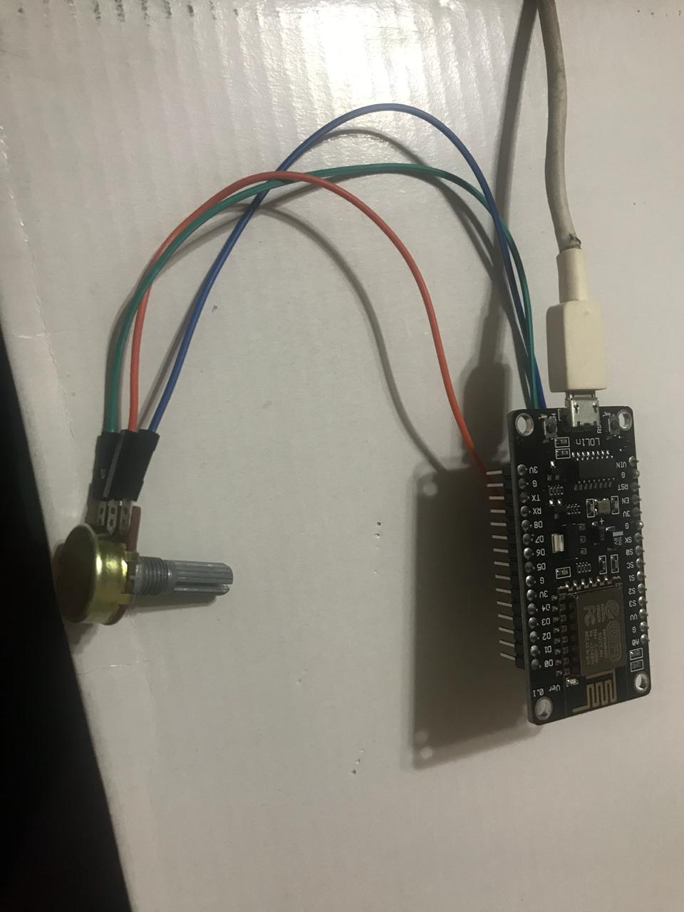
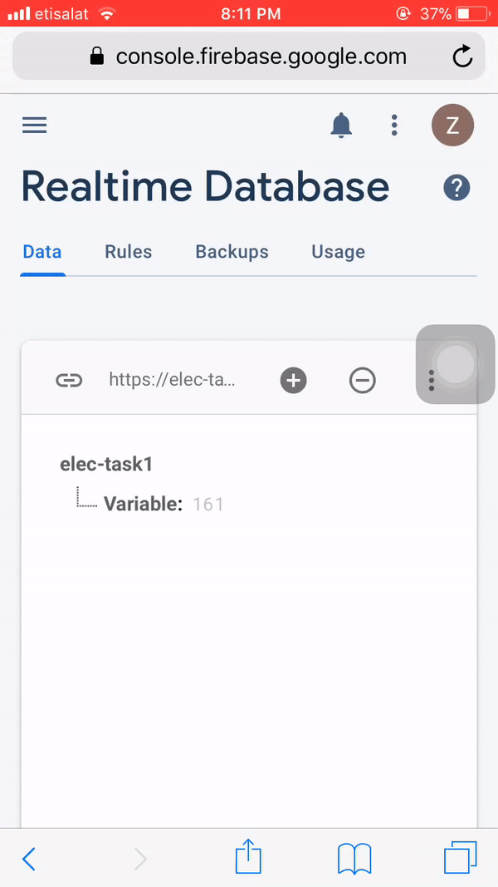
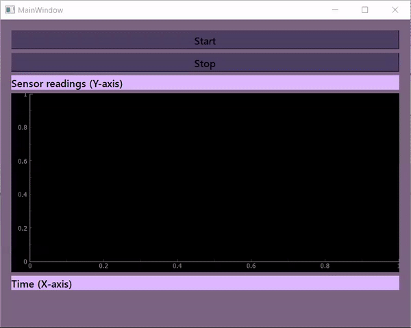

<!--Headline-->
<!--Image-->
<!--UL-->
<!-- URLs-->

# Task 1
# Team number: 17

# 1- Connecting potentiometer to esp:

# 2- Sending these sensor readings via WiFi:

# 3- Sending these sensor readings to different clients:
* "Desktop app, mobile app" Display and plot these readings in real time.
*    
# The Database represents:
* Potentiometer reading, Potentiometer is widely used in various fields: medical equipment, robotics.
## for pusposes such as:
## Temperature Control: 
* Control potentiometers may be used to adjust the amount of power supplied to a heater.
## Lighting  Control:
* Potentiometer controls may be used to vary light levels.
## Precision potentiometers:
* Where there is interest in the relationship between the incremental voltage level and the incremental  displacement of a mechanical device.
* The flexible joystick used for teleoperation. The joystick contains switches and sensors such as potentiometers to control the motion of the soft robot body.
